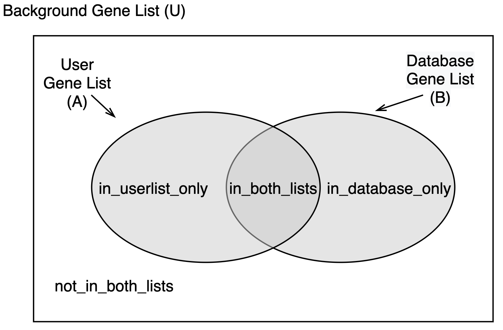
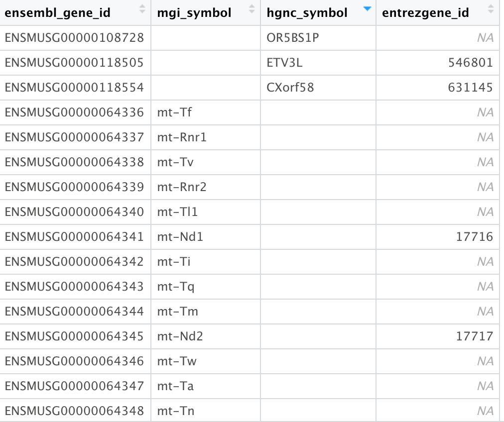

# MGEnrichmentApp

<!-- TOC depthFrom:1 depthTo:6 withLinks:1 updateOnSave:1 orderedList:0 -->

- [MGEnrichmentApp](#mgenrichmentapp)
	- [Basic Functionality/Explanation](#basic-functionalityexplanation)
	- [The mm10 Database](#the-mm10-database)
	- [How to Use the App](#how-to-use-the-app)
	- [Toy Datasets](#toy-datasets)
	- [Interpreting Results](#interpreting-results)
	- [Important Features/Limitations to Know:](#important-featureslimitations-to-know)
	  - [Filtering the Genes by Groups May Affect Results](#filtering-the-genes-by-groups-may-affect-results)
		- [Differing Results Based on Gene ID](#differing-results-based-on-gene-id)
		- [Union Size Must NOT Be Larger than Genome Size](#union-size-must-not-be-larger-than-genome-size)
		- [Overflow in Excel](#overflow-in-excel)
	- [Updating the Database](#updating-the-database)
	- [References](#references)

<!-- /TOC -->
This is the repository for the [Ciernia Lab's Microglia Gene Set Enrichment Calculator](https://ciernialab.shinyapps.io/MGEnrichmentApp/), an application built using the R Shiny package.

The calculator was built to enable those who may be less proficient in statistical analysis, or less familiar with the R programming language, to easily perform gene set enrichment analysis without needing to directly interface with R code. The app runs enrichment analysis on a list of manually curated mouse gene sets relevant to microglia and early development (and thus, to the Ciernia lab's field of research!). The hope is that users will be able to conduct gene set enrichment analysis on their own experiments, even if they are unfamiliar with R, or do not know how to implement gene set enrichment analysis.

## Basic Functionality/Explanation

We use the GeneOverlap Function (http://bioconductor.org/packages/release/bioc/html/GeneOverlap.html) to compare the user input list to each list in the database. Given the two gene lists, we test the significance of their overlap in comparison with a genomic background (specified "background universe" of genes) using a one-tailed Fisher's Exact Test. The null hypothesis is that the odds ratio is no larger than 1. The alternative is that the odds ratio is larger than 1.0. The user input list is compared to each list in the database in an independent test and then all tests are corrected for multiple comparisons using a False Discovery Rate (FDR) of .05.

## The Databases: mouse and human

The database of gene lists has been manually curated to include a wide assortment of microglial relevant gene lists collected from multiple treatments, disease states, etc in microglia or brain from mouse, human or rat. For the mouse database, all gene ids were converted to mouse if originally in human or rat. For the human database, all gene ids were converted to human if originally in mouse or rat.

A summary of the database including papers, lists and numbers of genes is included here as: 
Mouse: [MouseMasterSummary.final.csv](https://github.com/ciernialab/MGEnrichmentApp/blob/main/MouseMasterSummary.final.csv)
Human: [HumanMasterSummary.final.csv](https://github.com/ciernialab/MGEnrichmentApp/blob/main/HumanMasterSummary.final.csv)

The database includes the following information for each genelist within each dataset:
- **listname** - shorted description of the gene list
- **ensembl_gene_id** - all the ensembl IDs in the list
- **mgi_symbol or hgnc_symbol** - the corresponding gene symbols in the list
- **entrezgene_id** - the corresponding entrez IDs in the list   
- **listname** - a short and succinct name/tag for the list
- **description** - a longer description of what the genes in the list are (e.g. DEGs from WT vs Mutant microglia)
- **source** - paper citation for the list
- **groups** - broad category of the list, belonging to one of the following:
	- *Neuropsychatic & Neurodevelopmental Disorders human brain*
	- *Microglia Development*
	- *Microglia*
	- *ASD regulators*
	- *Inflammation*
	- *ASD genetics*

- **Species** - the species the list was originally collected from (rat, human, mouse). All genes are converted to Mouse IDs.         
- **tissue** - tissue type or cell type used in the dataset (ie. brain or microglia)
- **full.source** - full paper citation including the doi link

## How to Use the App

The app is designed to be quite straightforward and user-friendly, but brief instructions are provided here (and on the app itself) for convenience and clarity:

- **Uploading User Gene Set (Set A)** - the app can take in a gene set via text input in the textbox, or by uploading a dataset (acceptable file formats are csv, tsv and txt, and the file should only have one column containing the genes, with no header). The app can take in Ensembl, Entrez and MGI symbol gene IDs, but can only parse one type at a time, so all gene IDs need to follow the same ID type, and you must correctly specify which ID type you are using for the matching to work properly. If you are pasting in IDs, they can be separated by tabs, spaces or commas. The app currently only supports MOUSE gene IDs. The overlap calculations are performed using the gene ID type that the user selects. Since gene ID types are not always 1:1, if you switch ID types you may get slightly different overlap results (see limitations below).
- **Filtering Genes by Groups** - the app's database of genes can be grouped according to different categories (e.g. Microglia, Microglia Development, Inflammation, etc). By default, they are all selected, but you can deselect any desired groups to remove these genes from the enrichment calculation if they are not of interest. **Note that if you're selecting "All Genes in the Database" as your background gene set, this will affect the number of background genes used in the calculation.**
- **Selecting A Background Gene Set (Set U)** - the enrichment analysis uses the Fisher's Exact Test to measure the overlap between your uploaded gene set and the database of microglia gene sets. To do this, it needs a background "universe" number of genes to calculate how significant the overlap is. You can either set the background number of genes to be all mouse genes *(All mm10 Genes)*, or all the genes currently in the database *(All Genes in the Database)*. Alternatively, if you have your own set of genes you want to upload, you can upload a custom set by selecting *Custom*.
- **Uploading Background Gene Set** - If you do choose to upload a custom gene set, it must be large enough to serve as a background gene set (it should be larger than the largest gene set in the database (7266 genes) + your user uploaded gene set). See [here](#union-size-must-not-be-larger-than-genome-size) for clarification. Format for the custom background set follows the user-uploaded gene set format of one column only, with no header.
- **Filtering & Disabling IDs** - the p-value slider can be used to filter your results for FDR significance level. There are also checkbox options to remove the specified columns from the output, which may be useful if your gene set is very long (this can tend to skew the rows of your table and make it hard to view).
- **Querying Genes** - once you’re done toggling the various settings, you can click **Query Genes**, and the app will generate the resulting enrichment table, and you will be able to download the results as a csv file. Note that the results are only generated when the **Query Genes** button is clicked. If you make any further setting changes after generating results, recalculations will only come into effect when you click the button again to regenerate results.
- **Downloading Results** - simply click the "Download Results" button to export your results to a csv file. Note that the results download as is (whatever filtering settings you've used carry over - what you see is what you get).

## Toy Datasets
There are two toy datasets available to try out the enrichment analysis. Both contain differentially expressed genes from several papers comparing human brain ASD to controls, where expression levels were higher in ASD compared to controls **(ASD>Ctrl DEGs)** or lower **(ASD<Ctrl DEGs)**.

The datasets were generated from four previously published genelists (see [references](#references)). All four identified immune, and microglial, gene expression as altered in ASD brain. We took the published gene lists from these papers, divided them into genes with either increased or decreased expression in ASD and then overlapped the four sets to identify genes consistently identified in at least 3 out of the 4 datasets. Gene lists were then converted to mouse Ensembl Identifiers using biomart. 

You can try them both out by clicking on their respective buttons and querying the database.
Or, you can download the datasets and their output results directly [here.](https://github.com/ciernialab/MGEnrichmentApp/blob/main/Toy_Dataset_Input_and_Output.xlsx)

## Interpreting Results
- **listname** - name of the gene set that is being compared against.
- **pvalue** - p-value of enrichment analysis (as calculated by one-tailed Fisher's Exact Test).
- **OR** - the Odds Ratio.
- **notAnotB** - number of genes not in any gene set.
- **inAnotB** - number of genes in the user's uploaded gene set (set A) but not in the current database gene set being analyzed (set B).
- **inBnotA** - number of genes in the current database gene set (set B) but not in the user uploaded gene set (set A).
- **inBinA** - number of genes in both the current database gene set and the user uploaded gene set.
- **intersection_IDs** - the direct list of overlapping gene IDs (inBinA). This will be in the gene ID type that you have selected, and is the original overlap list, so use this for final results.
- **intersection_ensembl** - the intersection_IDs, converted to ensembl
- **intersection_mgi_symbol or intersection_hgnc_symbol** - the intersection_IDs, converted to symbols
- **intersection_entrez** - the intersection_IDs, converted to entrez
- **FDR** - false discovery rate correction value.
- **description** - brief description of gene set.
- **source** - literature source of gene sets, if applicable.
- **groups** - gene set category grouping.
- **Species** - the original species used to generate the list in the database. All gene IDs were converted to mouse IDs using BioMart. For example, gene lists in human brain were converted from hgnc_symbols to mouse ensembl IDs before inclusion in the database.
- **tissue** - the original tissue used to generate the dataset
- **full.source** - full citation with doi

The intersection_ids is the original list of overlapping gene IDs, in the format you uploaded and selected for your genes. The 3 successive columns after try to map the gene ID to its corresponding alternate ID equivalents, if possible (therefore one of the columns will be redundant, as it will be in the same gene ID type as what you uploaded, and due to [mapping](#differing-results-based-on-gene-id) problems, wit is not fully complete). It is provided only for convenience to potentially lookup genes of interest faster. When reporting results, use the intersection_ids column for the most accurate results.

## Important Features/Limitations to Know:

### Filtering the Genes by Groups May Affect Results

As stated above, deselecting any of the gene groups available (via the checkboxes) will remove the associated genes. As this reduces the number of genes in the database, if you are using **"All Genes in the Database"** as your background gene set, this will change the number of background genes used to in the enrichment analysis. Each gene list is only assigned to one group.

### Differing Results Based on Gene ID

Due to the nature of how gene IDs have been historically (and even contemporarily!) catalogued, the different gene symbols that we can use (MGI symbols, Ensembl IDs, Entrez IDs, etc) often have inconsistent IDs that do not map 1-1 between each ID (e.g. some ensembl IDs don't have an entrez ID equivalent, or some ensembl IDs map to multiple entrez IDs, etc.)

In dealing with this issue, since we wanted users to be able to upload IDs in any of the 3 usual formats, we decided to take the approach of using 3 different gene set lists. More specifically, we compiled our curated gene list database separately for each type of gene ID, based on the availability of gene IDs on biomaRt. This was done to ensure that Fisher's Exact calculations were precise and not being inflated by duplicate gene IDs.

As a result, this means that depending on which ID you use, the gene lists will have certain IDs that may not be present. Therefore, you will get slightly differing results for each gene ID.

**If possible, we recommend using Ensembl IDs,** as this would work best for our database (our list of MG relevant genes was originally compiled using Ensembl IDs). This should provide the most complete and accurate version of results.

### Union Size Must NOT Be Larger than Genome Size

When performing gene set enrichment analysis, the "background" gene set size (number of genes) that is chosen must always be greater than the combined size of the user uploaded gene set and each gene list in the database (if you think about it, it makes sense, because when comparing against a background set of genes, your background or "universe" set of genes should contain all of your genes). As such, if a user uploads their own background gene set, they must ensure it is large enough to serve as a background set.

<i> If you don't follow this, you might see the following error:</i>

Also note that when uploading genesets, the app only cares about the size of the geneset. It doesn't take into account the actual genes. All the genes in your custom background set should contain all the genes in the database, as well as your user uploaded gene sets, which is why it needs to be bigger than the union of the user uploaded gene set and the database gene set.

The largest gene set is currently 7266 genes long (**E18 vs P60 Female MG**). Thus, any background set uploaded must be greater than or equal to your uploaded gene set + 7266.

### Overflow in Excel
If the user's input gene set is very long, there is a chance the number of intersection gene IDs for each gene set can be very long as well. Excel has a limit of 32,767 characters per cell, and so if your intersection ID set exceeds this, this will overflow in Excel since the character string can't be contained in the cell, and the output of the string is carried over to the next line. In Excel, this is roughly:
- for ensembl (assuming mean length of 20 characters): ~1630 genes
- Entrez (assuming mean length of 8 characters): ~4090 genes
- MGI Symbol (assuming mean length 7 characters): ~4680 genes

You can also open the results on Google Sheets, which has a limit of 50,000 characters. This increases the limit slightly to:

- for ensembl (assuming mean length of 20 characters): ~2500 genes
- Entrez (assuming mean length of 8 characters): ~6250 genes
- MGI Symbol (assuming mean length of 7 characters): ~7140 genes

In cases where the user would prefer to use Excel, and would rather the values be truncated to avoid the overflow error, there is also the option to download the dataset with the results truncated (just disable the error-inducing column using the corresponding checkbox) to ensure that the maximum intersection gene IDs for each gene type does not exceed the above stated value, and to avoid overflow happening.

Alternatively, if you want the full results, you will either need to get the results while running the app, or open the csv file in another text editor (such as Notepad++, TextEdit, BBEdit, etc). Or you may view it on Excel, with the format messed up, if that doesn't bother you!

## Updating the Database

If you want to build your own version of the app and need to update the gene lists used in the database, you can consult the NewGeneLists.R script for an example on how to do this.

If you have any further questions or concerns about the app and how to use it, you can contact the Dr. Ciernia at annie.ciernia@ubc.ca or submit a github ticket on this hub.

## References
- Gupta S, Ellis SE, Ashar FN, Moes A, Bader JS, Zhan J, et al. Transcriptome analysis reveals dysregulation of innate immune response genes and neuronal activity-dependent genes in autism. Nat Commun [Internet]. 2014;5:5748. Available from: http://www.nature.com/doifinder/10.1038/ncomms6748
- Parikshak NN, Swarup V, Belgard TG, Irimia M, Ramaswami G, Gandal MJ, et al. Genome-wide changes in lncRNA, splicing, and regional gene expression patterns in autism. Nature [Internet]. 2016 Dec 5 [cited 2017 Jul 18];540(7633):423–7. Available from: https://www.ncbi.nlm.nih.gov/pubmed/27919067%5Cnhttp://www.nature.com/nature/journal/vaop/ncurrent/pdf/nature20612.pdf
- Gandal MJ, Zhang P, Hadjimichael E, Walker RL, Chen C, Liu S, et al. Transcriptome-wide isoform-level dysregulation in ASD, schizophrenia, and bipolar disorder. Science (80- ) [Internet]. 2018 Dec 14 [cited 2018 Dec 18];362(6420):eaat8127. Available from: http://www.ncbi.nlm.nih.gov/pubmed/30545856
- Gandal MJ, Haney J, Parikshak N, Leppa V, Horvath S, Geschwind DH. Shared molecular neuropathology across major psychiatric disorders parallels polygenic overlap. Science (80- ) [Internet]. 2018;693(February):693–7. Available from: http://biorxiv.org/content/early/2016/02/18/040022.abstract

<!---- ## Info for Developers

Provided here are tips/useful things to know that anyone who might want to modify the app may find useful.

At the moment, the app essentially serves as a wrapper for the GeneOverlap R package (which can be found on bioconductor).

If you ever need to modify the core functionality of the app, and find that the dashboard layout is interfering with output, you can simply remove the dashboard theme and stick with the default side bar layout that R Shiny utilizies. If needed, there is a copy of the app using the default layout, which can be found here().

The functions are executed pretty much sequentially exactly as they were laid out. For clarity's sake, I've provided a pseudo call graph here:

**need to write call graph**

------>
